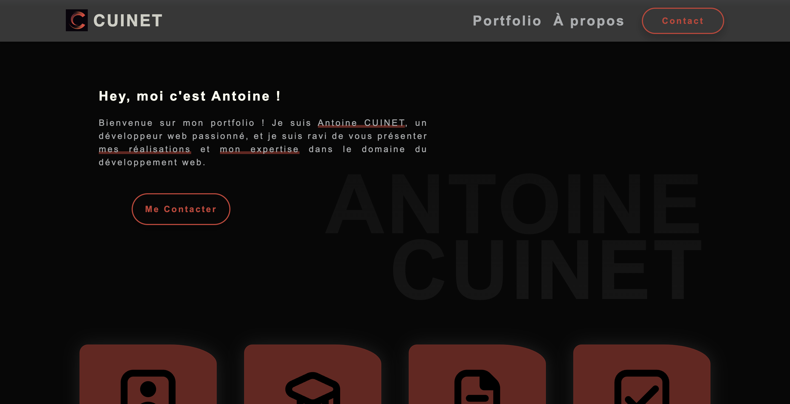

# CUINET Antoine

My personnal portfolio.
Discover on this site my personal portfolio presenting my skills, my qualifications, my completed projects...

## Constructions

A large part of the site is based on CSS effects to show my level in front-end development.

## Conclusion

Go to the site to admire the work: <a href="https://acuinet.fr" target="_blank">acuinet.fr</a>.
