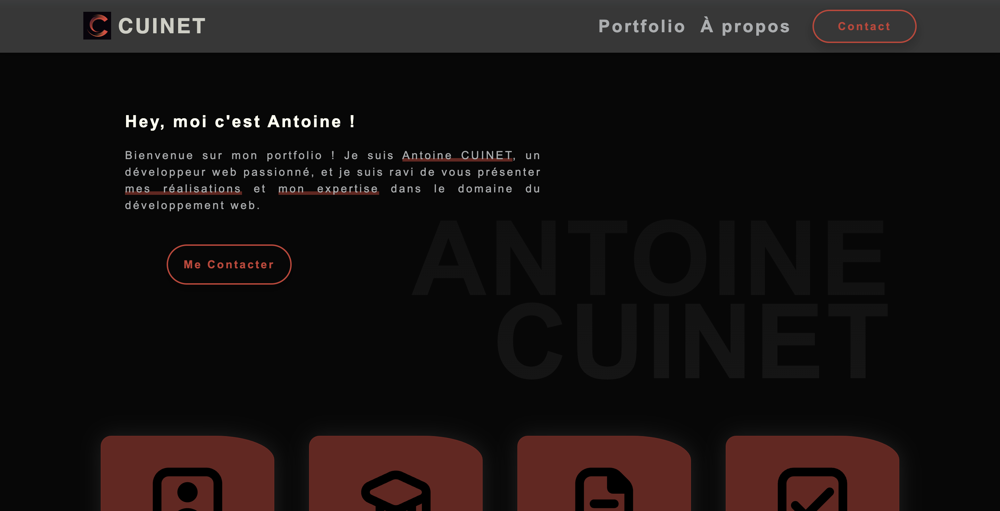

# 🌐 Portfolio personnel

Bienvenue dans le dépôt du site web de mon portfolio personnel !
Sur ce site, vous trouverez mon parcours professionnel, quelques projets réalisés, une page de contact et bien d'autres !



## 📋 Table des Matières

- [Présentation](#-présentation)
- [Fonctionnalités](#-fonctionnalités)
- [Arborescence du Site](#️-arborescence-du-site)
- [Technologies Utilisées](#-technologies-utilisées)
- [Installation et Lancement](#️-installation-et-lancement)
- [Auteur et Contact](#-auteur-et-contact)
- [Licence](#-licence)

## 📖 Présentation

Ce portfolio a été créé pour vous offrir un aperçu complet de mon parcours professionnel et de mes compétences. Vous y trouverez une sélection de mes projets réalisés, qui illustrent mon expertise et mon engagement dans divers domaines. Chaque section du site est conçue pour vous permettre de mieux comprendre mon approche du travail, mes domaines de spécialisation, et les outils que j'utilise.

## 🚀 Fonctionnalités

- Portfolio : Présentant les différents projets réalisés par catégories
- Contact : Permettant de prendre contact avec moi via un formulaire

## 🗂️ Arborescence du Site

- Accueil : Bref présentation de moi et de mon parcours
- Portfolio : Présentant les différents projets réalisés par catégories
- À propos : Présentant mon parcours, les languages, outils et logiciels métrisés
- Contact : Permetant de prendre contact avec moi

## 💻 Technologies Utilisées

- Frontend : HTML5, CSS3 (SASS), JavaScript
- Backend : PHP
- Base de Données : MySQL
- Versionnage : GitHub

## 🛠️ Installation et Lancement

### Prérequis

- npm

### Installation

1. Tout d'abord, assurez-vous de bien avoir `node.js` d'installé sur votre machine (au moins v20.6.1).

2. Clonez le dépôt du projet :

    ```bash
    git clone https://github.com/AntoineCuinet/ofni-website.git
    cd ofni-website
    ```

3. Afin d'installer les dépendances du projet, ouvrez votre terminal à la racine du projet puis entrez cela :

    ```bash
    npm install
    ```

### Lancement

Afin de lancer le projet, il suffit d'entrez cette ligne de commande dans le terminal, à la racine du projet :

```bash
npm start
```

Une fois cela fait, vous pouvez commencer à coder !

Pour cela, il vous suffit de modifier les fichiers `.php` présent dans le dossier `public` ainsi que les fichiers présent dans le dossier `assets` en respectant l'arborescence des fichiers déjà créer.

NE PAS MODIFIER LE CODE DANS LES FICHIERS `style.css`, cela n'aura aucun impact car nous utilisons le pré-processeur SASS (fichiers `.scss`) !

### Build pour la production

```bash
npm run build-sass
```

## 👥 Auteur et Contact

### Auteur

Antoine CUINET - Développeur Web, pour plus d'informations, [voir ce site: portfolio de Antoine CUINET](https://acuinet.fr/)

### Contact

#### Mail

[Antoine CUINET](mailto:antoine@acuinet.fr)

#### Site Web

[Antoine CUINET](https://acuinet.fr/)

## 📜 Licence

Ce site web a été entièrement conçu et développé par Antoine CUINET. Toute reproduction, distribution, ou utilisation de ce site, en totalité ou en partie, est strictement interdite sans autorisation préalable. Pour toute demande d'utilisation ou de collaboration, veuillez contacter l'équipe via la section [Contact](#contact).
